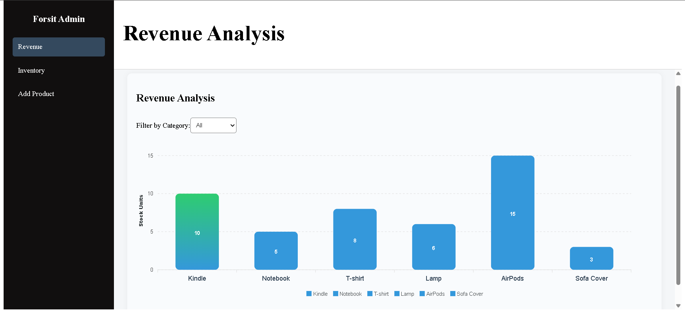
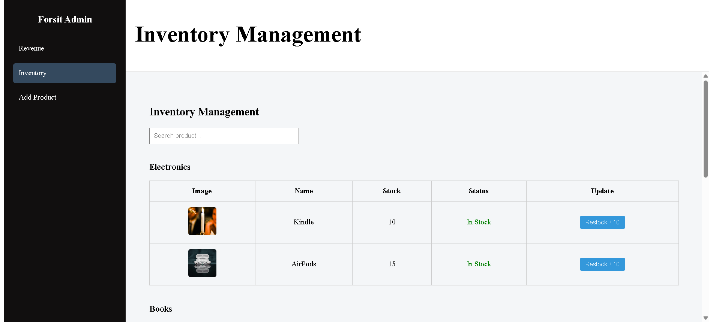
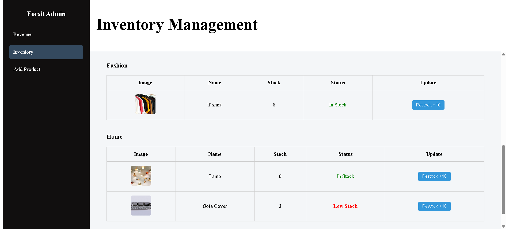
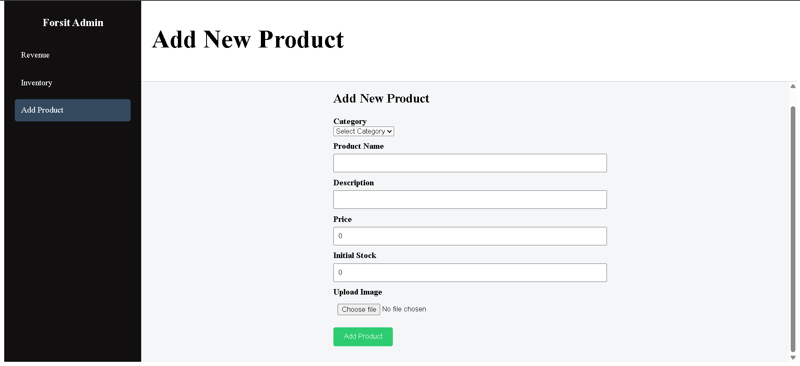

# E-commerce Admin Dashboard

A modern and responsive admin dashboard for managing an e-commerce platform. Built using **Vue 3**, this dashboard allows e-commerce managers to view revenue analytics, manage inventoryband register new products all with clean visuals and real-time updates.

---

## Screenshots

> Replace these with actual screenshots from your project!

### Revenue Dashboard



### Inventory Management





### Add Product Form



---

## Features

### Revenue Analysis Page

- Real-time display of total orders and revenue.
- Interactive charts using `apexcharts` to show sales trends.
- Filter revenue by product categories.
- Supports daily, weekly, monthly and annual comparison views.

### nventory Management Page

- Lists all products with stock status.
- Search and filter products.
- Shows product images in the list.
- Low inventory alert system.
- Allows restocking inventory directly.

### Product Registration Page

- Form to add new products with:
  - Product name, description, price and stock
  - Image upload with live preview
- Instantly updates the Inventory page after adding

---

## 🛠️ Tech Stack

| Layer | Tools |
|-------|-------|
| Frontend | Vue.js 3, Vue Router |
| Charts | Vue ApexCharts |
| State Sharing | Vue’s provide/inject |
| Styling | Pure CSS, Google Fonts |
| Data | Sample products like Amazon & Walmart |

---

## 💾 Installation Instructions

```bash
git clone https://github.com/YOUR_USERNAME/ecommerce-admin-dashboard.git
cd ecommerce-admin-dashboard
npm install
npm run serve
